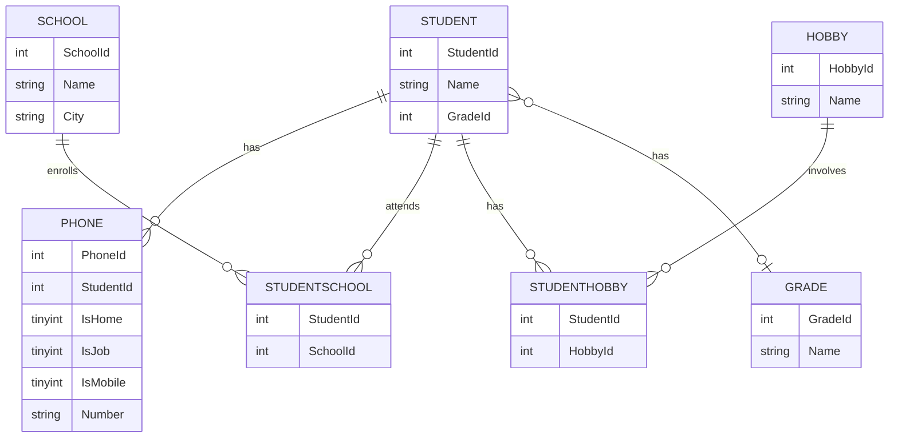

# db2022-inl-mningsuppgift
Slutprojekt i databas-kursen

## Entity Relationship Diagram



## Normalisera databas

### Första gången

```bash
cd ~/ws
git clone https://github.com/JoJoRapp/db2022-inl-mningsuppgift.git
cd db2022-inl-mningsuppgift
```

```bash
docker pull mysql/mysql-server:latest
```

```bash
docker run --name container-with-mysql\
           -e MYSQL_ROOT_PASSWORD=root\
           -e MYSQL_USER=user1\
           -e MYSQL_PASSWORD=iths\
           -e MYSQL_DATABASE=iths\
           -p 3306:3306\
           -d mysql/mysql-server:latest
```

```bash
curl -L  https://gist.github.com/miwashiab/d891a64c7f73f4c8c3b5cfee2b3de776/raw/denormalized-data.csv -o denormalized-data.csv
curl -L  https://gist.github.com/miwashiab/e39a3228f0b389b6f3eca1b8c613bb2e/raw/db.sql -o db.sql
```

### Varje gång

```bash
cd ~/ws/db2022-inl-mningsuppgift
```

```bash
docker start container-with-mysql
```

```bash
docker cp denormalized-data.csv container-with-mysql:/var/lib/mysql-files
```

```bash
docker exec -i container-with-mysql mysql -uroot -proot < db.sql
```

```bash
docker exec -i container-with-mysql mysql -uroot -proot <<< "grant all on Chinook.* to 'user1'@'%'"
docker exec -i container-with-mysql mysql -uroot -proot <<< "grant all on iths.* to 'user1'@'%'"
docker exec -i container-with-mysql mysql -uroot -proot <<< "grant file on *.* to 'user1'@'%'"
```

```bash
docker exec -i container-with-mysql mysql -uuser1 -piths < normalisering.sql
```

> #### MacOS/UNIX
>
> ```bash
> docker exec -it container-with-mysql bash
> ```
>
> #### Windows
>
> ```bash
> winpty docker exec -it container-with-mysql bash
> ```

```bash
mysql -uuser1 -piths
```

```sql
use iths;
show tables;
exit
```

```bash
exit
```

## Köra Javakoden

Följande instruktion förutsätter att instruktionerna ovan har följts först.

```bash
gradle check
gradle run
```
