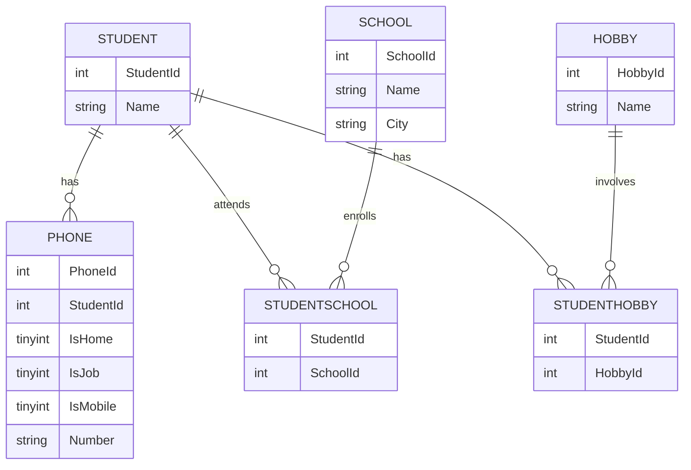

# db2022-inl-mningsuppgift
Slutprojekt i databas-kursen

## Entity Relationship Diagram

```mermaid
erDiagram
	STUDENT ||--o{ PHONE : has
	STUDENT ||--o{ STUDENTSCHOOL : attends
	STUDENT ||--o{ STUDENTHOBBY : has
	SCHOOL ||--o{ STUDENTSCHOOL : enrolls
	HOBBY ||--o{ STUDENTHOBBY : involves
	STUDENT {
		int StudentId
		string Name
	}
	SCHOOL {
		int SchoolId
		string Name
		string City
	}
	PHONE {
		int PhoneId
		int StudentId
		tinyint IsHome
		tinyint IsJob
		tinyint IsMobile
		string Number
	}
	HOBBY {
		int HobbyId
		string Name
	}
	STUDENTSCHOOL {
		int StudentId
		int SchoolId
	}
	STUDENTHOBBY {
		int StudentId
		int HobbyId
	}
```
